# Manual editorial de WordPress

Guía de trabajo para el equipo de Egia Kermanentzat Elkartea. Está escrita en castellano; junto a cada nombre importante se indica la etiqueta o el ejemplo equivalente en euskera (EU).

Este manual cubre publicaciones, cronología, hemeroteca, fuentes, imágenes, traducciones, programación y avisos por email. No autoriza a modificar tema, plugins, usuarios, migraciones, copias de seguridad ni configuración técnica.

## 1. Acceso seguro

1. Abre la dirección de administración facilitada por soporte y comprueba que empieza por HTTPS.
2. Inicia sesión con tu cuenta personal de rol **Editora Kermanentzat**. No compartas cuentas ni contraseñas.
3. Activa MFA en cuanto la administración técnica habilite el segundo factor. Si MFA todavía no aparece en el perfil, pide su activación; WordPress no lo incorpora por sí solo.
4. No aceptes guardar la contraseña en un ordenador compartido.
5. Al terminar, abre el menú superior derecho y pulsa **Cerrar sesión / Saioa itxi**.

El rol editorial muestra Medios, Páginas, Berriak / Actualidad, Cronología y Fuentes. No muestra Plugins, Apariencia, Ajustes ni Usuarios. Si aparecen esas opciones, detente y comunica que la cuenta tiene más permisos de los necesarios.

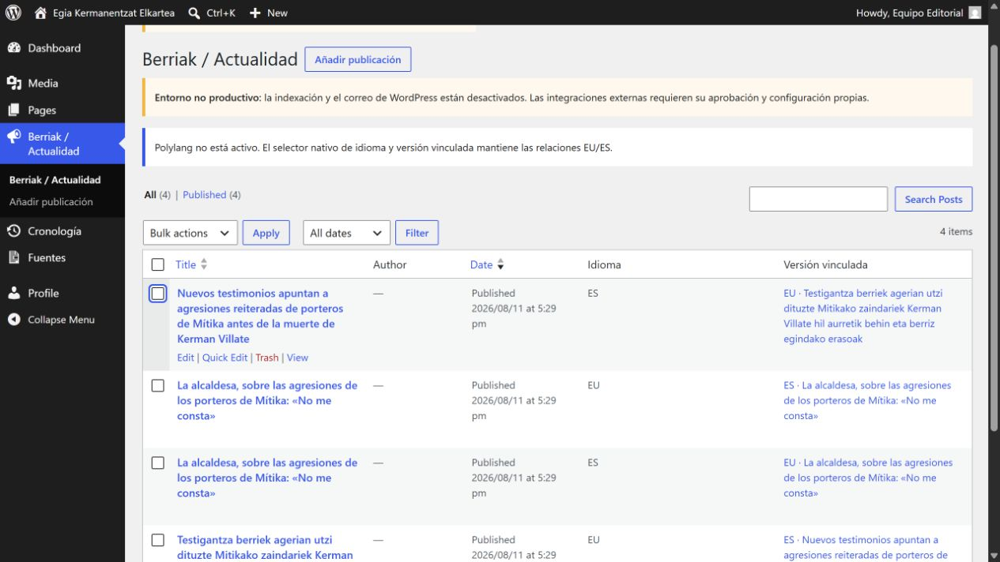

## 2. Qué se puede cambiar

| Área | Tipo | Cómo se mantiene | Qué no tocar |
|---|---|---|---|
| Relato del caso | Editable con cautela | Páginas → Kasuaren laburpena / Resumen del caso | No borrar el módulo de cronología ni cambiar la estructura sin revisión |
| Cronología clave | Dinámica | Cronología → un hito por fecha e idioma | No escribir la cronología a mano dentro de la página |
| Berriak / Actualidad | Dinámica | Una publicación estructurada por noticia, nota, comunicado, actividad o hemeroteca | No editar las tarjetas desde la página Berriak |
| Hemeroteka / Hemeroteca | Dinámica | Publicaciones de tipo Hemeroteca, con enlace y atribución | No copiar artículos o imágenes de terceros |
| Fuentes | Editable y privada | Fuentes → ficha interna vinculable | No subir expedientes ni datos sensibles |
| Imágenes | Editable y validada | Medios → alt, crédito, derechos y permiso | No publicar una imagen sin derechos comprobados |
| Suscripción | Dinámica y condicionada | Sender, cola y WP-Cron cuando exista aprobación | No activar Sender, pegar tokens ni importar Excel por cuenta propia |
| Cabecera, pie, estilos, plantillas y código | Estática/versionada | Tema, plugin y despliegue técnico | No tocar |
| Páginas legales | Editable solo con aprobación | Páginas legales ES/EU | No improvisar cambios jurídicos |

Las páginas Berriak, Actualidad, Kronologia, Cronología, Hemeroteka, Hemeroteca, Harpidetza y Suscripción son contenedores. Su contenido visible se genera a partir de las entidades editoriales. Si una tarjeta o un hito está mal, corrige la entidad; no el contenedor.

~~~mermaid
flowchart LR
    U["Berriak / Actualidad"] --> A["Noticias, notas, comunicados y actividades"]
    H["Hemeroteka / Hemeroteca"] --> P["Referencias de prensa"]
    C["Kasuaren laburpena / Resumen"] --> T["Hitos de Cronología"]
    P --> F["Fuentes privadas"]
    A --> F
    T --> F
    A --> S["Aviso Sender, cuando esté aprobado"]
~~~

## 3. Flujo editorial recomendado

No publiques directamente una primera versión. Trabaja en borrador, revisa el contenido y completa la pareja EU/ES.

~~~mermaid
flowchart LR
    B["Borrador"] --> R["Revisión de hechos, privacidad y derechos"]
    R --> T["Crear y vincular traducción EU/ES"]
    T --> V["Previsualizar ambas versiones"]
    V --> P["Publicar o programar"]
    P --> C["Comprobación pública"]
~~~

Checklist antes de publicar:

- El título y el resumen dicen lo mismo en EU y ES.
- Hechos, citas y valoraciones están atribuidos.
- Se han eliminado datos personales innecesarios.
- Los enlaces funcionan y la fuente está registrada.
- Cada imagen tiene texto alternativo, crédito y derechos.
- Si el contenido es sensible, las tres comprobaciones y la referencia de aprobación están completas.
- La fecha editorial es correcta.
- La versión vinculada apunta al contenido del otro idioma.
- **Enviar aviso al publicar** solo se marca cuando Sender está aprobado y se desea realmente un único aviso.

## 4. Crear una noticia, nota, comunicado, actividad o hemeroteca

1. Ve a **Berriak / Actualidad → Añadir publicación**.
2. Escribe el título, el cuerpo y un extracto breve.
3. En **Datos editoriales**, elige **Tipo**:

   - Noticia / Albistea.
   - Nota de prensa / Prentsa-oharra.
   - Comunicado / Komunikatua.
   - Actividad / Jarduera.
   - Hemeroteca / Hemeroteka.

4. Indica la **Fecha editorial**. No la confundas con la fecha técnica de guardado.
5. Marca **Destacar en portada** solo para una pieza prioritaria.
6. Vincula las fuentes que sostienen el contenido.
7. Completa revisión, idioma y traducción.
8. Usa **Previsualizar** antes de publicar.

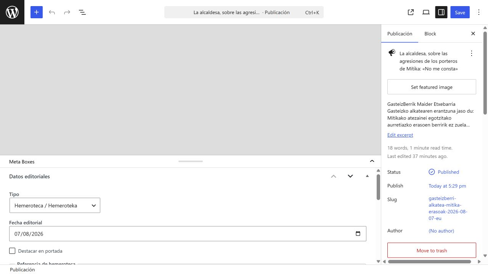

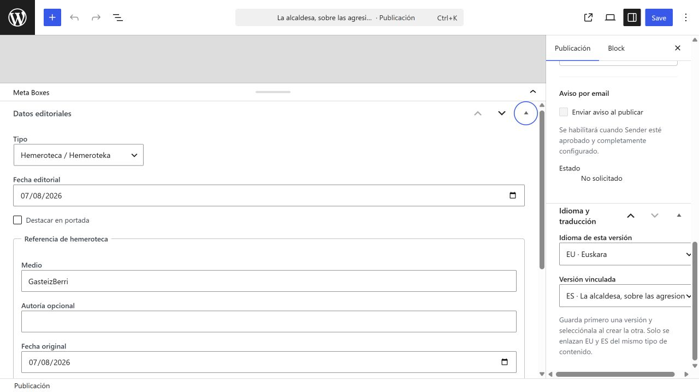

### Campos adicionales de una actividad

Al elegir Actividad / Jarduera aparecen inicio, fin opcional, lugar y enlace de inscripción o información. Comprueba la zona horaria y revisa el estado público:

- Próxima / Hurrengoa.
- En curso / Abian.
- Finalizada / Amaituta.

### Campos adicionales de hemeroteca

Completa medio, autoría si se conoce, fecha original y URL original. El cuerpo debe ser un resumen propio y atribuido. No pegues el artículo completo y no descargues su fotografía salvo que exista un permiso documentado.

El resultado público agrupa las piezas por tipo y mantiene el enlace externo:

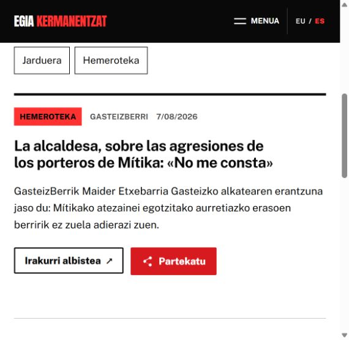

## 5. Crear y vincular la pareja EU/ES

Cada idioma es una entrada independiente. El enlace nativo funciona aunque Polylang no esté instalado.

1. Crea y guarda primero una versión, por ejemplo EU.
2. Crea la segunda versión ES.
3. En **Idioma y traducción**, selecciona **ES · Castellano** para esa segunda versión.
4. En **Versión vinculada**, elige la entrada EU correcta.
5. Guarda.
6. Vuelve al listado y comprueba las columnas **Idioma** y **Versión vinculada** en ambos sentidos.

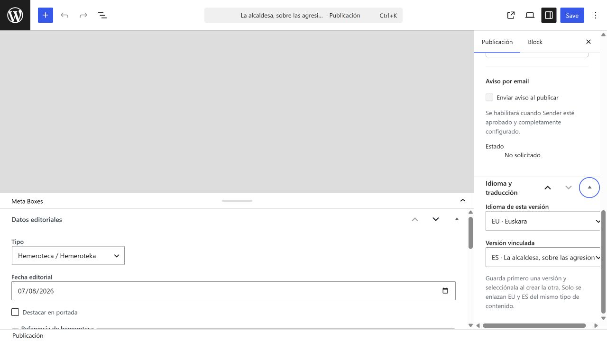

No enlaces dos entradas del mismo idioma. Si falta una traducción publicada, el selector público conduce al archivo del otro idioma e informa de que esa traducción todavía no está disponible; nunca debe mostrar el texto equivocado bajo otra etiqueta de idioma.

~~~mermaid
flowchart TD
    E["Entrada EU"] --> Q{"¿Existe versión ES publicada?"}
    Q -- Sí --> L["Selector abre la versión ES y añade hreflang"]
    Q -- No --> F["Selector abre Actualidad con aviso de traducción no disponible"]
    S["Entrada ES"] --> R{"¿Existe versión EU publicada?"}
    R -- Sí --> K["Selector abre la versión EU y añade hreflang"]
    R -- No --> G["Selector abre Berriak con aviso de traducción no disponible"]
~~~

## 6. Añadir o corregir un hito de cronología

1. Ve a **Cronología → Añadir hito**.
2. El título debe describir el hecho, no solo repetir la fecha.
3. Escribe un resumen breve y atribuible.
4. En **Datos editoriales**, completa:

   - Fecha inicial.
   - Fecha final, solo si es un periodo.
   - Precisión: Día, Mes, Año o Periodo.
   - **Destacar este hito** para que aparezca en la cronología clave del resumen.
   - Fuentes relacionadas.

5. Completa la revisión sensible cuando corresponda.
6. Crea y vincula la versión del otro idioma.
7. Publica o programa y revisa Kasuaren laburpena y Resumen del caso.

El orden no se arrastra manualmente: se calcula por fecha inicial, fecha final y un desempate estable. Para mover un hito, corrige su fecha. No pongas fechas falsas para forzar una posición.

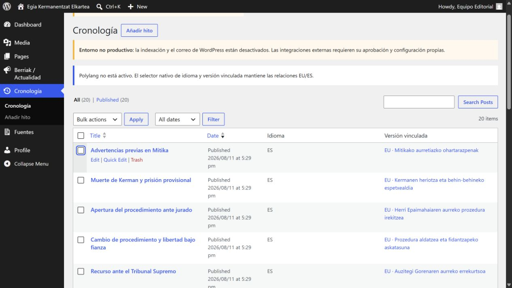

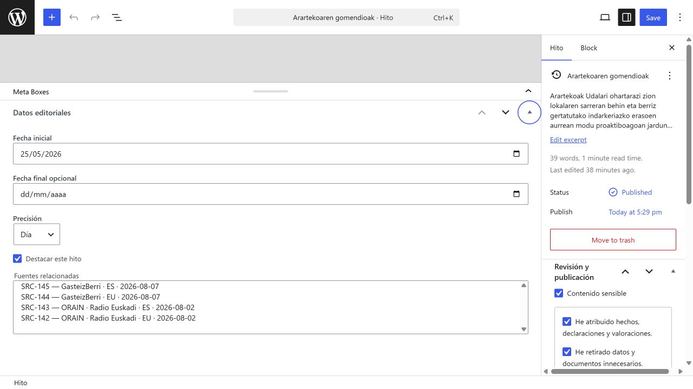

Resultado esperado en escritorio:

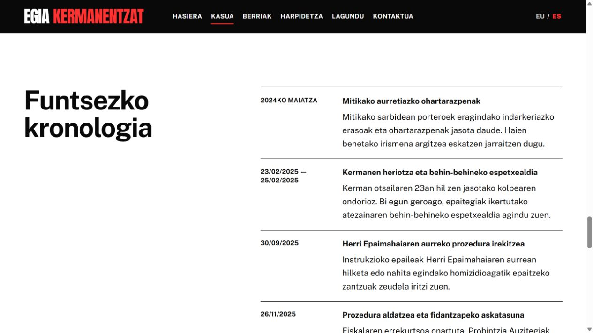

Resultado esperado en móvil:

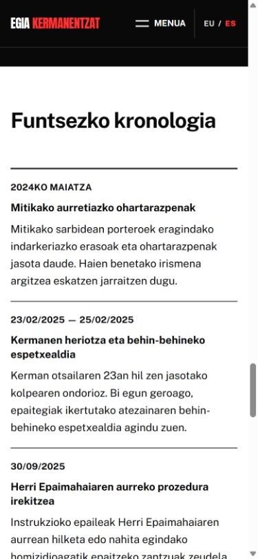

## 7. Registrar y usar una fuente

Las fuentes son privadas en WordPress: ayudan a justificar una publicación, pero su ficha no tiene página pública.

1. Ve a **Fuentes → Añadir fuente**.
2. Usa un título reconocible: entidad, idioma y fecha.
3. Completa autor o entidad, fecha, URL pública, URL archivada si existe y última comprobación.
4. Guarda como privada.
5. En la noticia o el hito, selecciónala en **Fuentes relacionadas**.

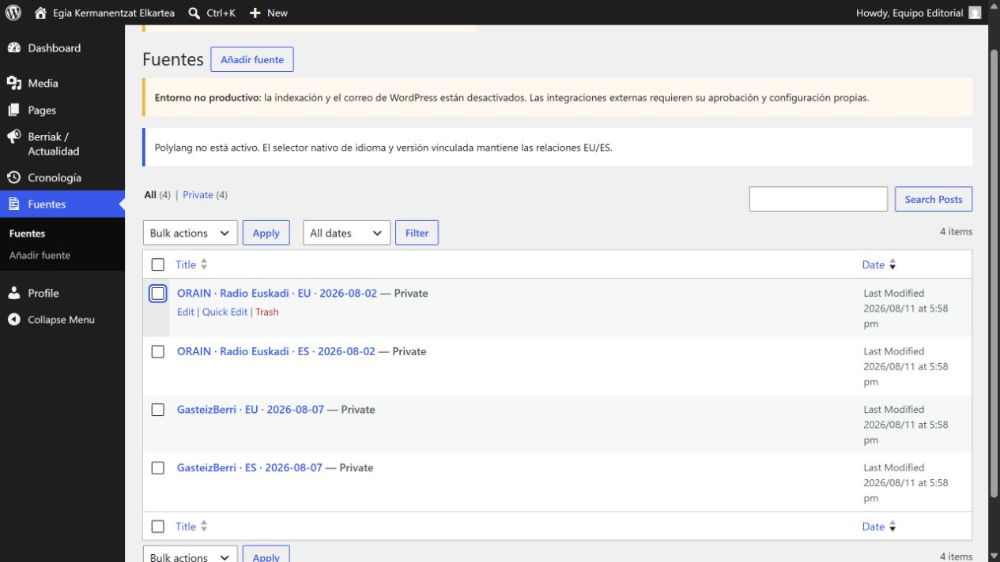

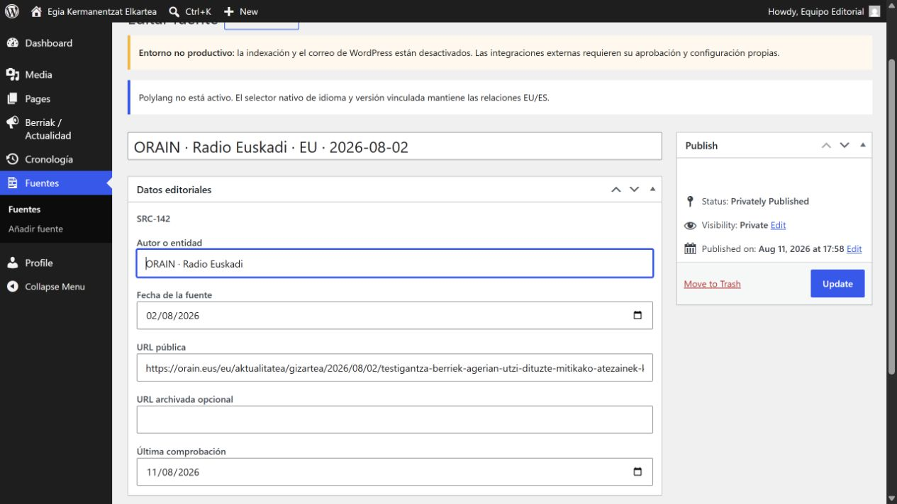

No incluyas nombres privados, teléfonos, documentos, datos de salud, datos judiciales no públicos ni rutas que revelen el expediente. La **Referencia de aprobación externa** debe ser un código o ubicación controlada, nunca el documento ni un enlace público.

## 8. Imágenes, crédito y derechos

1. Sube solo imágenes propias, licenciadas o con permiso documentado.
2. Abre el medio después de subirlo.
3. Escribe un **Texto alternativo** que explique la función de la imagen. Déjalo vacío solo si es puramente decorativa.
4. Añade **Crédito editorial**.
5. Elige **Derechos**:

   - Propio.
   - Licenciado.
   - Permiso documentado.
   - Solo enlace externo.
   - Pendiente.

6. Para Licenciado o Permiso documentado, añade una referencia de permiso sin datos sensibles.
7. No publiques mientras el estado sea Pendiente.

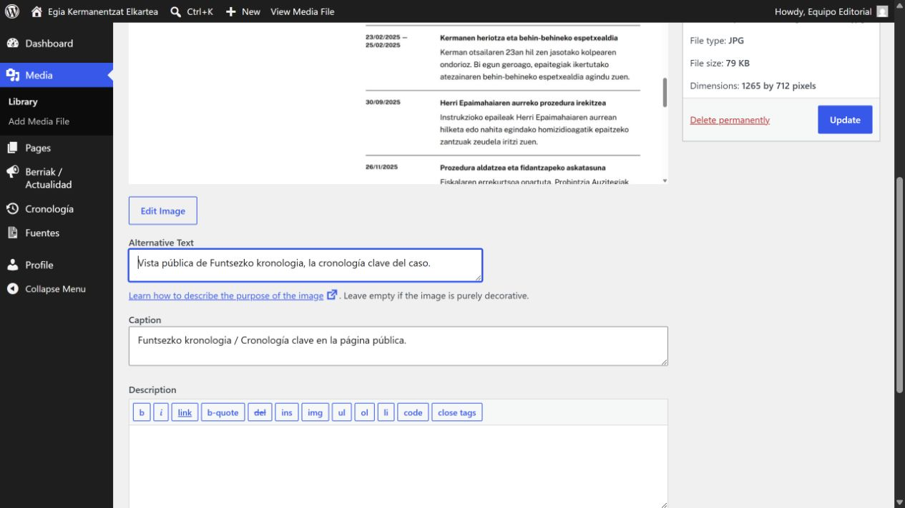

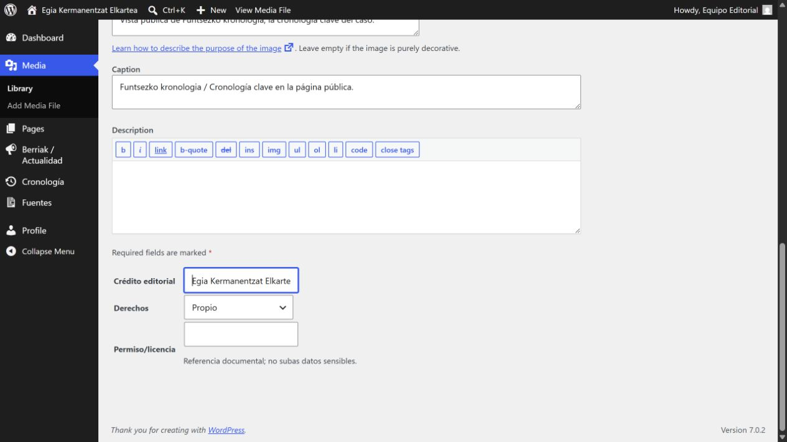

WordPress bloquea la publicación si una imagen usada carece de texto alternativo, crédito o justificación de derechos. No evites el bloqueo retirando datos: completa la documentación o sustituye la imagen.

## 9. Contenido sensible

Marca **Contenido sensible** cuando la pieza trate hechos judiciales, violencia, salud, datos personales o afirmaciones con riesgo para terceros. Deben quedar marcadas:

- He atribuido hechos, declaraciones y valoraciones.
- He retirado datos y documentos innecesarios.
- He comprobado derechos y créditos de los medios.

Añade una referencia de aprobación externa que permita a la asociación localizar la revisión fuera de WordPress.

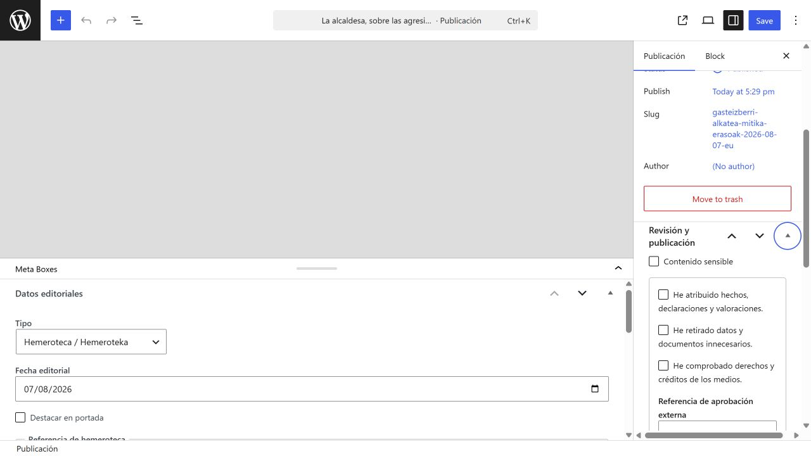

Si falta una comprobación o referencia, WordPress conserva la entrada como borrador. No publiques información sensible para “probar cómo queda”.

## 10. Previsualizar, programar, corregir y recuperar

### Previsualizar

Usa **Vista previa / Aurrebista** y comprueba:

- título, extracto, enlaces e imagen;
- versión EU y versión ES;
- móvil y escritorio;
- página de archivo y página individual;
- cronología, si has cambiado un hito.

### Programar

1. En la barra lateral abre la fecha de publicación.
2. Elige fecha y hora futuras.
3. Confirma que WordPress muestra **Programada / Scheduled**.
4. WP-Cron revisa la cola cada cinco minutos en staging y producción.

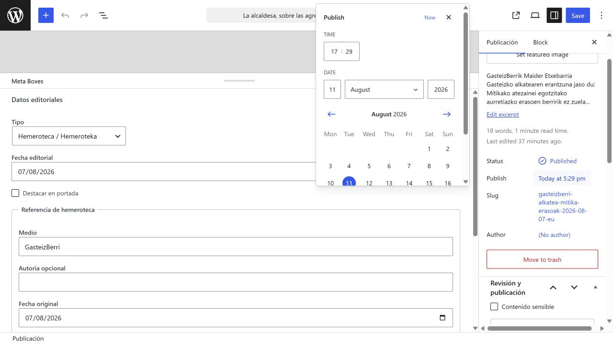

### Corregir una publicación

Haz una corrección pequeña sobre la entrada publicada, explica el cambio en el texto si altera el sentido y actualiza también su traducción. Después revisa canonical, selector de idioma y tarjeta de archivo.

### Recuperar una revisión

Abre la entrada y busca **Revisiones** o la indicación de última edición. Compara la versión anterior antes de restaurarla. Restaurar una revisión no sustituye la revisión EU/ES: comprueba ambas entradas después.

## 11. Sender, suscripciones y avisos

En este momento Sender permanece desactivado hasta completar la revisión documental, contractual, DNS y humana. Por eso la casilla **Enviar aviso al publicar** aparece deshabilitada. Es el comportamiento correcto.

Cuando soporte confirme por escrito la activación:

- la casilla seguirá desmarcada por defecto;
- marcarla solicitará un único aviso para la pareja EU/ES;
- guardar, corregir o traducir no volverá a enviar;
- WP-Cron procesará la cola;
- los estados serán No solicitado, En cola, Enviando, Enviado, Fallido o Cancelado;
- **Reintentar** solo se usará después de corregir la causa del fallo;
- tras tres fallos se detendrá el envío automático.

~~~mermaid
sequenceDiagram
    participant E as "Editora"
    participant W as "WordPress"
    participant C as "WP-Cron"
    participant S as "Sender"
    E->>W: Programa o publica EU/ES con aviso marcado
    W->>W: Crea una identidad única para la pareja
    C->>W: Procesa la cola cada 5 minutos
    W->>S: Crea una campaña bilingüe
    S-->>W: ID de campaña o error
    W-->>E: Enviado, En cola o Fallido
~~~

No pegues tokens en WordPress. No importes el Excel real desde el administrador. La preparación e importación se realiza con soporte técnico después de revisar consentimiento, duplicados, bajas y supresiones. Nunca se reintroduce una dirección dada de baja.

## 12. Checklist después de publicar

- La URL abre sin iniciar sesión.
- La pieza aparece en Berriak / Actualidad o en la página dinámica adecuada.
- EU y ES están vinculadas.
- El selector de idioma abre la pareja correcta.
- La fecha, el tipo y la atribución son correctos.
- Los enlaces externos abren el medio original.
- La imagen conserva alt, crédito y derechos.
- En móvil no hay desplazamiento horizontal.
- Si se solicitó aviso, el estado cambia una sola vez; no repitas la publicación.
- No hay datos privados visibles.

## 13. Problemas habituales

~~~mermaid
flowchart TD
    I["Incidencia"] --> V{"¿La entrada no se ve?"}
    V -- Sí --> D{"¿Está publicada o programada y tiene el idioma correcto?"}
    D -- No --> D1["Corrige estado, fecha e idioma"]
    D -- Sí --> C{"¿Tipo, fecha editorial y página dinámica son correctos?"}
    C -- No --> C1["Corrige campos; no edites el contenedor"]
    C -- Sí --> S["Pide soporte: caché, plantilla o migración"]
    V -- No --> T{"¿Falta traducción o está mal vinculada?"}
    T -- Sí --> T1["Selecciona la pareja en Idioma y traducción"]
    T -- No --> O{"¿Orden de cronología incorrecto?"}
    O -- Sí --> O1["Corrige fecha y precisión"]
    O -- No --> E{"¿Campaña en cola o fallida?"}
    E -- Sí --> E1["No republiques; revisa estado y pide soporte antes de reintentar"]
    E -- No --> X["Si el diseño está roto, detente y pide soporte"]
~~~

### Entrada invisible

Comprueba estado, fecha de programación, idioma y tipo. Una entrada futura no aparece antes de su hora. Una entrada ES no aparece en Berriak EU.

### Traducción ausente

Comprueba las columnas Idioma y Versión vinculada. Ambas entradas deben apuntar al mismo par EU/ES y estar publicadas si se espera selector directo.

### Orden incorrecto en cronología

Corrige fecha inicial, fecha final y precisión. No dupliques el hito.

### Campaña en cola o fallida

No desmarques, vuelvas a marcar ni republiques. Si Sender está desactivado, no debe salir ningún aviso. Si está aprobado, pide soporte para revisar cron, conectividad y el error antes de usar Reintentar.

### Diseño roto

No abras Apariencia, Plugins ni el editor de código. Guarda como borrador, anota la URL y el momento del fallo, y pide soporte.

## 14. Cuándo detenerse y pedir soporte

Detente ante cualquiera de estas situaciones:

- error de estructura, plantilla, shortcode o bloque protegido;
- plugin, tema, código, migración, base de datos o copia de seguridad;
- alta, baja, permisos o MFA de usuarios;
- activación de Sender, DNS, token, campaña duplicada o importación real;
- dato sensible publicado o posible incidente de privacidad;
- imagen sin derechos claros;
- URL, canonical, selector EU/ES o diseño que no se corrige editando el contenido;
- duda jurídica o lingüística.

No intentes arreglar un problema técnico eliminando contenido, cambiando plugins o creando una segunda publicación. Conserva el borrador y facilita a soporte la URL, la hora, el navegador y una descripción sin datos sensibles.
